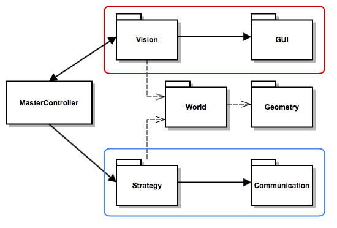
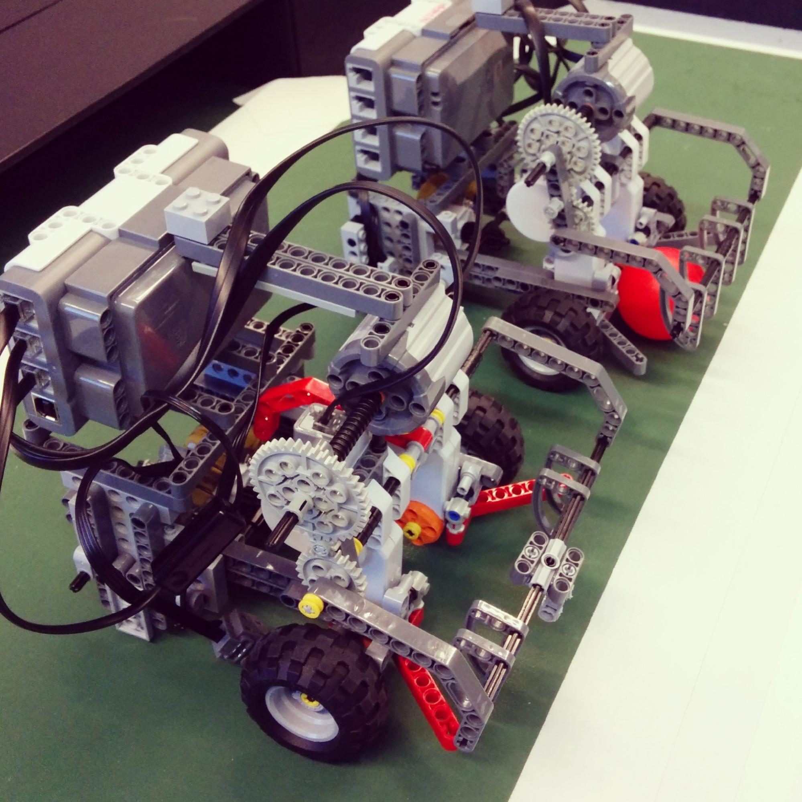

# Introduction

The purpose of this report is to describe our efforts to build LEGO Mindstorms NXT robots capable of playing Robot Foosball. We used the LeJOS Java library for all parts of the project. In our initial vision we decided to split the project into 6 components connected through our main controller with library-like interfaces. This architecture is  presented in figure 1.

In this report, we will outline the design of each of the components, their purpose and motivation for why we used them.

# Team Management

## Initial plan 

We looked at group reports of previous year groups to find a good team management strategy. We used Github for version control, Trello for task-management and Facebook for discussion. The work distribution for the first three milestones was to have most of our members working on code to pass the milestones and few people focusing on the other components which were going to be used in latter stages of the course.

This method got us through the first two milestones for which we received high marks. However, it did not provide good enough starting ground for the third milestone for which we were not able to field robots. There were multiple reasons for this.

## Change of plans

Firstly, team members were working in seclusion which meant others did not know how to use the work they had done. Secondly, the code was complicated and was not tested incrementally but merged together a few days before the milestone. Finally, most members were not clear on how to help with the project.

To attempt to improve our team organisation, we started having more regular meetings, particularly face to face. We also decided to abandon Trello because team members were neglecting to look at it, and only use Github to manage project tasks. We therefore had a simpler and unified way of managing the project.

# Robot Design

The first milestone involved tracing a line round a section of the pitch. The initial design of the Robot for the first milestone required two light sensors, which we used to tell the difference between the green of the pitch and the white boundary lines. Experimenting with having one or two light sensors, either using one in the middle of the front of the robot or two, one at either side of the front of the robot.

The second milestone was to kick a ball from various positions of the pitch. We experimented with different kicker designs and positions, such as kicking from the side of the robot, or kicking from the front, which we discovered to be a far more effective strategy.

Firstly we tried to use a regular servo motor for the kicker, but this proved to take up too much space in the robot and often struggled to fit in with size constraints, especially once we added the cumbersome brick.
We then used a smaller, stronger motor for the kicker design to maximize torque. Using a simple gear train we dramatically increased the speed of the kicker. The kicker had an attached grabber cage, so we could hold the ball and maneuver at the same time.

The Robot used a simple two wheel drive using Lego Servo motors for accurate rotations, as speed was not high priority. A third holonomic wheel at the back of the Robot was then added to enable smooth rotations and add stability. We experimented with using a four-wheeled drive, using only two motors, gearing the wheels of sides together. This presented problems with turning however, as having front and back wheels moving at the same speed with rubber wheels caused the robot to jerk a lot and have unpredictable turns.

For our final design we took some inspiration from more successful teams, such as the kicker being attached to a cage which we used as a grabber. To ensure the ball was always caught at the same place of the robot for consistent kicks we added two pincer-like parts onto the front of the robot to guide it into the middle, and had curved pieces attached to the cage, which we tested the positions of so that wherever the cage caught the ball, it would always be driven to the same place of the robot when it closed.

# Communication

To avoid having to build it from scratch, we decided to base our communication system on the code of a previous year’s group. We chose Group 4 from 2013 as theirs seemed straightforward.

After the PC connected to the NXT brick via Bluetooth, commands could be sent to the robot such as “move” and “rotate”. We represented these as an opcode along with optional parameters to specify, for example, movement speed. As new commands were being chosen by the strategy system, these could be queued up on the PC side and then sent to the robot in sequence. If a sequence of commands had to be changed, the queue could be cleared.

# Vision

Initially, our vision system was based on Group 4 from 2013 and implemented without use of any vision libraries. This resulted in low frame rate, around 10 frames per second (fps), and needlessly complicated implementation which was difficult to parameterise.

This is why we decided to rewrite it, taking ideas from group 9 from 2011, during week 4 using the OpenCV library. It took us about a week to re-implement but it was well worth it. The new vision system was able to correctly detect the position of the ball, and the position and orientation of robots.

Furthermore, the system was very easy to configure and was running at the optimal 25 fps. In a nutshell, the vision system is responsible for grabbing the image from the camera using V4L4J, feeding it to processing it using OpenCV, and updating the world state afterwards.

There are three main stages when processing the image:

__Pre-Processing__

In this stage the system performs camera lens distortion correction, which removes fisheye distortion caused by the camera, crops the image to remove unimportant sections, and applies a median filter to the image to remove noise. These steps proved to be important as without them the quality of the image was substandard and regular shapes such as the pitch were distorted.

__Object Detection__

In this stage, we convert the image into HSV representation. We then perform minimum/maximum thresholding on each channel. This proved to be effective, especially with configurable thresholds. We also tried solutions with RGB representation and adaptive thresholding but these did not work well because of varying lighting conditions or were difficult to implement correctly.

Furthermore, we perform contour extraction and calculate image moments. With these methods we were able to detect image blobs and their properties such as their centre. We also compute areas to filter out blobs that do not resemble the ball or the robots. Thanks to this, our system avoided falsely detecting people’s hands as balls during matches.

Retrieving the orientation of robots proved to be very challenging. Our system thresholds for the dots only within a small radius around the centre of the base plate. This proved to be reliable and avoided the problem of detecting black-coloured parts of the robots as the dot.

__Post-Processing__

In this stage we perform perspective projection correction and convert all coordinates to millimeters. Perspective correction was important as without it a robot and a ball with the same x-coordinate on the pitch would not appear as aligned due to robot’s greater height. After the perspective correction, the difference in x-coordinate of an aligned ball and robot was smaller than 1 cm. Converting to millimeters allowed for a more precise and unified representation of objects across both pitches.

# Vision GUI

This is the part of our project which was visible to the user during matches. It provided information on object positions, quick thresholding, and saving thresholds for each PC in a separate JSON file. The last point was important as different PCs delivered different images - contrast and brightness varied.

# Strategy

Although our strategy system was basic, it contained all the necessities. The defender copies the y-coordinate of the ball whenever it is defending and it tries to grab the ball and pass it whenever it is in the same zone.

The attacker does something similar

# Lessons Learned

Our performance by the end had significantly improved because we adopted a better approach:

 - Keep it simple: write simple, modular code. Only make changes in small increments, don’t introduce a lot of new untested code in a single stage.
 - Organise effectively: have more regular team meetings, everyone should aware of what everyone else is doing.
 - Don’t reinvent the wheel: use libraries and reuse code wherever possible - don’t build from scratch unless there is a significant benefit. 
 - Finalise the robot design early on: reduce repeated testing because each new design had to be tested, and frequent redesigns wasted time which could have been better spent elsewhere
 - Test frequently: we used some JUnit Test, but generally after any changes to the robot or the code test the functionality thoroughly, not just with one small scope test.
